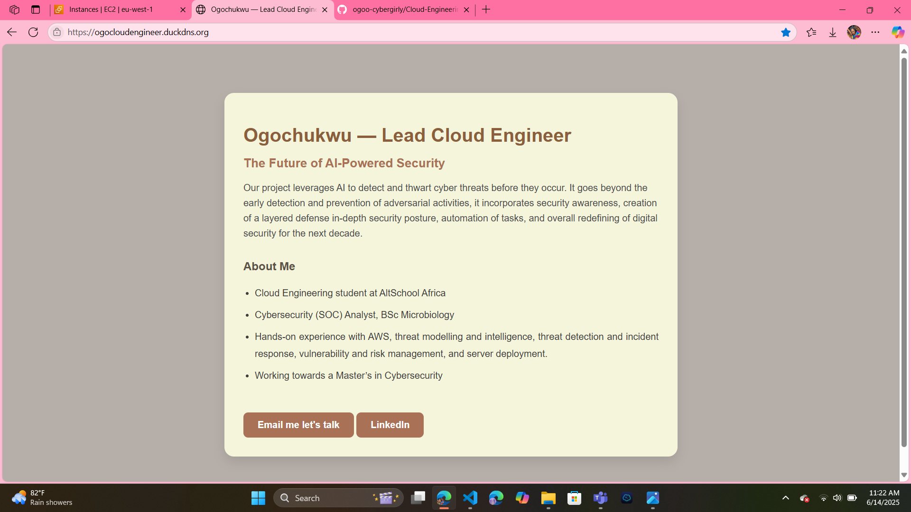

# Cloud-Engineering-Second-Semester-Examination-Project
My dynamic prototype of a web application to showcase my technical skills to investors for my new startup.

Project Title: The Future of AI-Powered Security

Hi, my name is Ogochukwu, the lead cloud engineer bringing this project to your doorstep.

Technologies used:
AWS EC2 (Ubuntu 22.04)
Visual Studio Code
DuckDNS
Github

Steps and procedures:
 Establish a SSH connection between my AWS EC2 instance and my vs code.
 Installed Nginx.
 Edited the inbound rules of my EC2 security group by allowing HTTP/HTTPS (port 80 and port 443) to render the installed Nginx using my AWS EC2 public IP address.
 Enabled firewall on system startup after ensuring it doesn't lock me out of SSH connection by allowing port 22.
 Installed Nodejs.
 Nginx efficiency was made successful by using a reverse proxy. Nginx proxying a node.js app for better complexity.
 Created a nodeapp directory, navigated to the directory, and created a nano editor text file called app.js.
 My dynamic web page prototype was developed in the app.js text file using HTML and CSS.  
 Set up a custom subdomain on DuckDNS, updated its IP address to my AWS EC2 public IP address, the subdomain name is https://ogocloudengineer.duckdns.org/.
 Secured with Let's Encrypt SSL (Certbot).

Challenges Encountered:
Node.js is a foreground process, it took a lot of initiating and killing process, and research to figure out what tool to use to keep it running in the background.
Not the best creative person so it was even a  tougher battle to come up with colors that will look good on a webpage and still represent me efficiently. 
  

Proof of Concept
Live site: [http://ogocloudengineer.duckdns.org](http://ogocloudengineer.duckdns.org)

Contact: [cyberogochukwu@gmail.com](mailto:cyberogochukwu@gmail.com)

